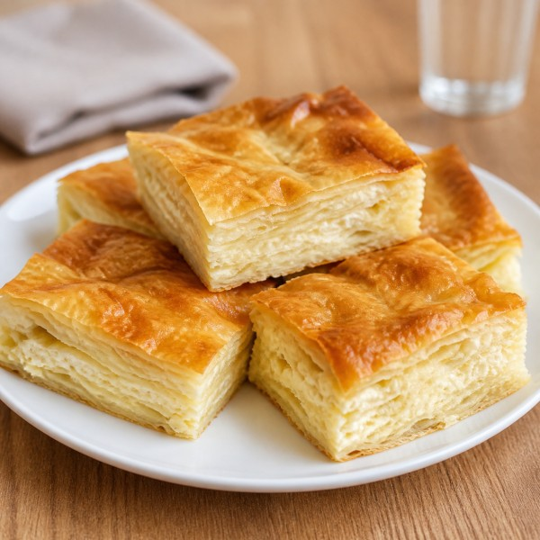
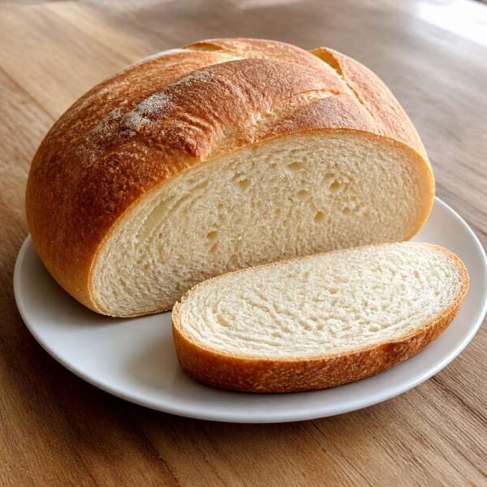
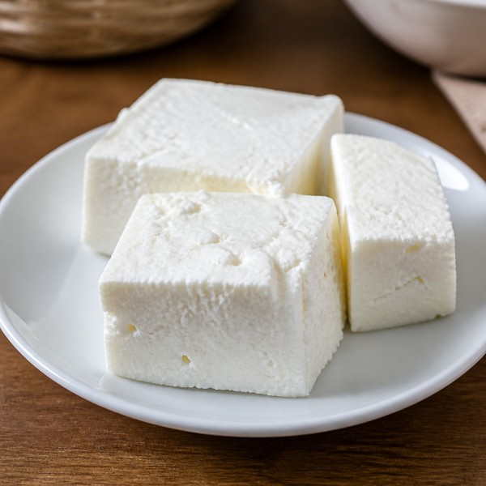
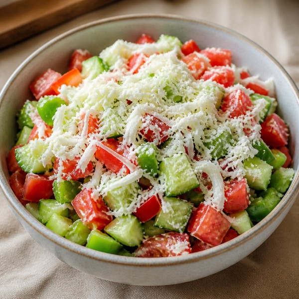
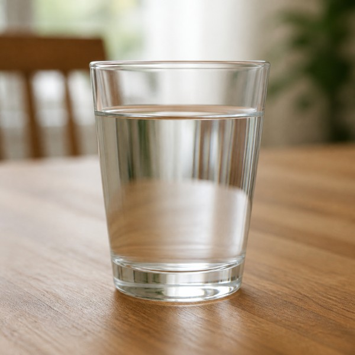
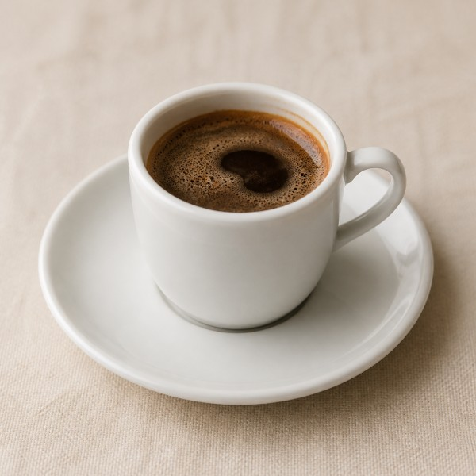
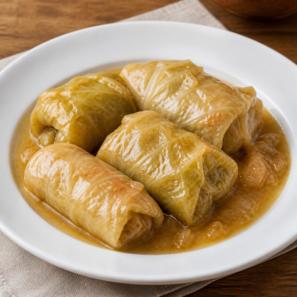
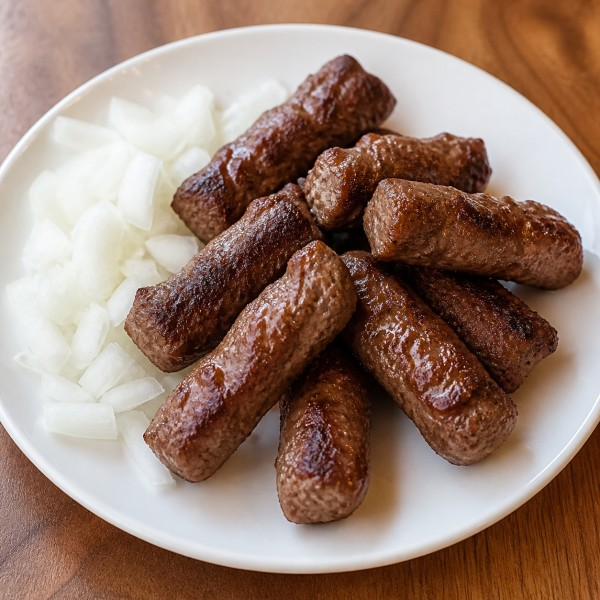
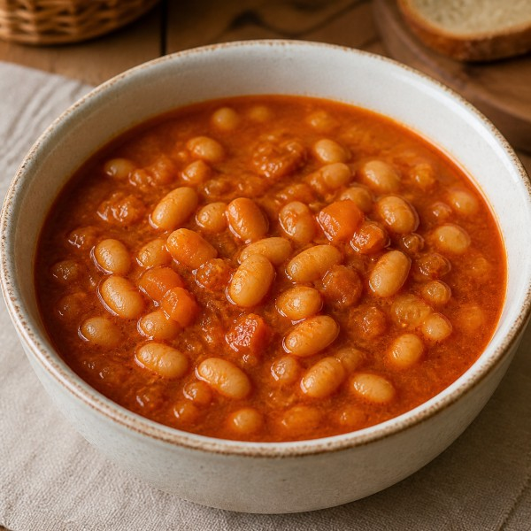

# Serbian 4
## За столом · Za stolom

Offer, accept, decline, and ask for food or drink.

---

# Conversation review

Greet me, ask how I am, introduce one person, and say one true family fact.

---

# Listen first

**Baka:** Amaya, hoćeš li pitu? 
**Amaya:** Da, molim. Hvala! 
**Baka:** A Marko, hoćeš li još? 
**Marko:** Ne, hvala. Sit sam. 
**Amaya:** Voda, molim.

Who accepts? Who declines? What does Amaya ask for?

---

# Four useful moves

**Hoćeš li ...?** — Would you like ...? (`ti`) 
**Hoćete li ...?** — Would you like ...? (`Vi`) 
**Da, molim.** — Yes, please. 
**Ne, hvala.** — No, thank you.

---

# Food and drink

 <b>пита</b> · pita

 <b>хлеб</b> · hleb

 <b>сир</b> · sir

 <b>салата</b> · salata

 <b>вода</b> · voda

 <b>кафа</b> · kafa

Choose the items that belong at a real family meal.

---

# Three Serbian dishes

 <b>сарма</b> · sarma

 <b>ћевапи</b> · ćevapi

 <b>пасуљ</b> · pasulj

Which would you choose? Ask for it in Serbian.

---

# Ask for something

**Voda, molim.** — Water, please. 
**Mogu li da dobijem vodu?** — May I have some water? 
**Izvolite.** — Here you are. / Please.

Learn the whole phrases; no case table today.

**Шта је ово?** · `Šta je ovo?` 
**Шта желиш / желите?** · `Šta želiš / želite?`

---

# A true reaction

**Volim pitu.** — I like pie. 
**Ne volim kafu.** — I don’t like coffee. 
**Ukusno je.** — It is delicious. 
**Sita sam. / Sit sam.** — I am full.

---

# `š` and `ž`

**š**: `šta`, `još` 
**ž**: `želim`, `kaže`

Keep the vowel in `još` short and steady.

---

# Cyrillic bridge

`Ш = Š` · `Ж = Ž` · `З = Z` · `Г = G` · `Ф = F`

**још** · **жена** · **сир** · **вода** · **хлеб**

Read for sound first; meaning is already known.

---

# Read: Sunday lunch

> Amaya i Marko su kod bake i dede. Na stolu su pita, salata, sir i hleb. Baka pita: „Amaya, hoćeš li još pite?” Amaya kaže: „Da, molim. Pita je veoma ukusna!” Marko kaže: „Ne, hvala. Sit sam.” Deda kaže: „Ukusno je!”

`baka` grandmother · `deda` grandfather · `na stolu` on the table · `veoma` very

---

# Talk about it

- Where are Amaya and Marko?
- What is on the table?
- What does Amaya accept?
- What would be on the table at your ideal Serbian meal?

Retell, react, and ask one follow-up question.

---

# Read again in Cyrillic

> Амаја и Марко су код баке и деде. 
> На столу су пита, салата, сир и хлеб. 
> Бака пита: „Амаја, хоћеш ли још пите?” 
> Амаја каже: „Да, молим. Пита је веома укусна!” 
> Марко каже: „Не, хвала. Сит сам.” 
> Деда каже: „Укусно је!”

Find **на столу** and **код баке и деде**.

---

# Dinner-table role-play

Round 1: Marko offers food. 
Round 2: an older relative offers food. 
Round 3: ask for something that is across the table.

Use a true preference at least once.

---

# Exit conversation

Without notes: offer one item, accept or decline, ask for a drink, and react to the food.
